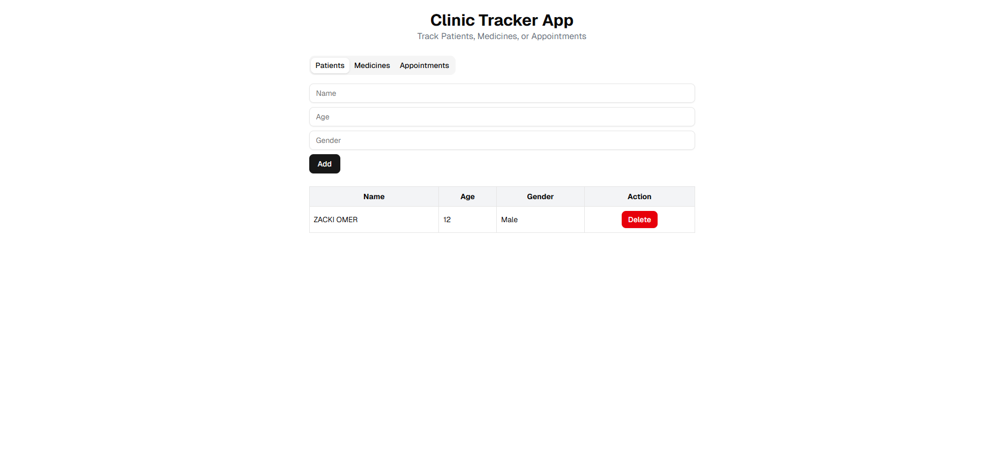

# Clinic Tracker App (Weekly Challenge #56) - ONLINE COURSE

## 💼 Client Story
Client (clinic CEO) requested a simple app to track basic items like Patients, Appointments, or Medicines.

## ✨ Features
- Add / Remove tracker items
- Dynamic form per type
- Clean UI using Tailwind + ShadCN
- Responsive and usable in-browser
- Optional: LocalStorage persistence

## 🖼️ Screenshot

## ⚙️ Tech Stack
- Next.js
- Tailwind CSS
- ShadCN UI
- React useState / useEffect
